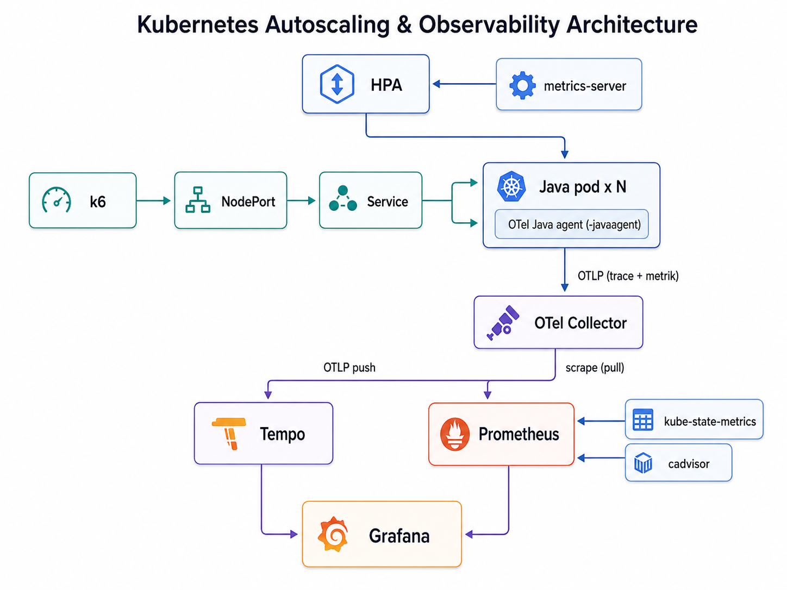

# Rapor

## 1. Mimari

* k6 servise yük üretir. Trafik NodePort üzerinden Kubernetes Service'e gelir ve çalışan Java pod'ları arasında dağıtılır.

* HPA, metrics-server üzerinden pod'ların CPU kullanımını takip eder. CPU hedefin üzerine çıktığında replica sayısını artırır, yük düştüğünde tekrar azaltır.

* Java pod'larında OpenTelemetry Java Agent çalışır (Auto-instrumentation). Kod değişikliği gerektirmez. Uygulamanın trace verileri OTLP ile OpenTelemetry Collector'a gönderilir, Collector da bu trace'leri Tempo'ya iletir. Collector kullanımı tercih edildi ve iki konuda fayda sağladı:
   1. Kubernetes özniteliklerini (`k8s.pod.name` gibi) o ekliyor.
   2. Uygulama tek bir adres tanıyor. 

* Uygulama metrikleri de Collector'e push edilir. Prometheus uygulama metriklerini Collector'den scrape ederek toplar. Remote write ise veriyi Thanos ya da Mimir gibi uzun süreli bir depoya aktarmak için kullanılır. kube-state-metrics Kubernetes obje durumlarını, cAdvisor ise container CPU ve memory gibi metrikleri sağlar.

* Grafana, Prometheus ve Tempo'yu datasource olarak kullanır. Böylece trafik, CPU kullanımı, pod sayısı, HPA ölçekleme davranışı ve trace'ler aynı yerden izlenebilir.

---

## 2. Kararlar ve gerekçeleri

| Karar | Değer | Gerekçe |
|---|---|---|
| **Resource request / limit** | `cpu: 500m`, `memory: 512Mi` | Resource değerleri production sizing iddiasıyla değil, lokal ortamda HPA davranışını net şekilde gözlemleyebilmek ve aynı anda birden fazla replica çalıştırabilmek amacıyla düşük ve kontrollü seçildi |
| **JVM heap** | `-XX:MaxRAMPercentage=75` | JVM heap’inin container memory limitinin tamamını kullanmaması için %75 seçildi. Kalan alan metaspace, thread stack, direct buffer ve diğer native memory kullanımları için bırakıldı. |
| **HPA metriği** | CPU utilization | Uygulama CPU-bound olduğu için CPU utilization seçildi. Trafik arttığında CPU tüketiminin doğrudan yükselmesi ölçekleme davranışını sade ve öngörülebilir şekilde göstermek için uygun bir metrik. |
| **HPA hedefi** | %20 (= 100m) | Lokal demo ortamında ölçeklemeyi daha kolay ve görünür şekilde tetiklemek için düşük bir CPU utilization hedefi seçildi. |
| **scaleUp / scaleDown** | 0 sn / 120 sn | Ani trafik artışına hızlı cevap verilmesi hedeflendi. Ayrıca kısa süreli düşüşlerde replica sayısının hemen azaltılması engellendi. |
| **Replica aralığı** | 1 – 10 | Üst sınır, lokal cluster kapasitesini aşmadan 10x trafik senaryosunu gösterebilecek şekilde seçildi. |
| **Readiness probe** | `/health`, 5 sn aralık, 3 sn timeout, 3 deneme | 5 saniyelik kontrol aralığı hızlı tepki için yeterli; 3 saniyelik timeout ve 3 başarısız deneme ise kısa süreli gecikmelerde pod’un hemen servisten çıkarılmasını önler. |
| **Liveness probe** | `/health`, 15 sn aralık, 5 sn timeout, 6 deneme | Liveness probe, container’ı restart ettiği için readiness probe’a göre daha toleranslı ayarlandı. Uygulama yaklaşık 90 saniye boyunca sağlık kontrolüne cevap vermezse container yeniden başlatılır. |
| **Node kapasitesi** | 1 control-plane + 2 worker, sabit | Node kapasitesi sabit tutuldu; HPA ile pod seviyesinde ölçeklenmeye odaklanıldı. İki worker node, ölçeklenen pod’ların cluster içinde dağıtılabilmesi için seçildi.|

---

## 3. Karşılaşılan problemler ve teşhis

**1. HPA hiç ölçeklenmedi.** İlk yük testinde replica sayısı 1'de kaldı, `kubectl get hpa` çıktısı  `cpu: <unknown>` gösterdi. `kubectl describe pod` çıktısında liveness probe hatası ve 4 restart görüldü. 

HPA CPU metriğini alamadığı için scale-up gerçekleşmedi. Aynı anda tek pod aşırı yük altında kaldı; health endpoint cevap veremeyince liveness probe restart döngüsüne girdi ve servis kapasitesi daha da düştü.

Çözüm olarak Probe timeout'ları gevşetildi.

**2. 10 pod açıldı ama gecikme düzelmedi.** p99 plato boyunca 4,8 saniyede kaldı. Toplam yük
saniyede 36 istekti, 10 pod'un bunu rahat karşılaması gerekirdi.

Pod bazında CPU ve istek sayısı sorgulandığında dağılımın bozuk olduğu görüldü: bir pod 497m ile
limitindeydi, üç pod ise 0m, yani hiç istek almamıştı.

Sebebi k6'nın HTTP bağlantılarını yeniden kullanması (keep-alive). Kubernetes Service L4 seviyesinde çalışıyor ve dağıtımı istek bazında değil bağlantı bazında yapıyor. Test başlarken tek pod olduğu için bütün bağlantılar ona kuruldu. HPA 9 pod daha açtı ama mevcut bağlantılar taşınmadı.

`noConnectionReuse: true` ile tekrar çalıştırıldığında trafik normal dağıtıldı ve p95 4.590 ms'den 217 ms'ye indi. 

**3. HPA 10 replica'ya çıkmıyordu.**

Replica sayısı 4-7 arasında salınıyordu. Önce yük artırılarak çözülmeye çalışıldı ama işe yaramadı: 100 → 200 → 250 kullanıcı denemeleri 4 → 7 → 5 → 6 pod verdi. ramping-vus closed-loop çalıştığı için VU sayısını artırmak doğrudan request rate’i artırmadı. Servis yavaşladıkça her VU cevabı daha uzun bekledi ve throughput plato yaptı. Bu yüzden CPU yükü 10 replica gerektirecek seviyeye çıkmadı. 

Çözüm olarak **ramping-vus** yerine **ramping-arrival-rate** kullanıldı. Böylece trafik kullanıcı sayısıyla değil doğrudan req/s üzerinden kontrol edildi ve servis yavaşlasa bile hedef request rate korunarak HPA’nın 10 replica’ya kadar çıkması sağlandı.

---

## 4. Prod'a alacak olsaydım

| Değişiklik | Neden |
|---|---|
| **CPU limitini kaldırmak** | CPU-bound servislerde limit koymamak genel tavsiyedir. Prod ortamında CPU-bound ve latency-sensitive bir servis için CPU limitini kaldırmak değerlendirilebilir. CPU limitleri hard ceiling olarak uygulanır ve limite gelindiğinde container throttling yaşar; bu da boş node kapasitesi olsa bile uygulamanın CPU burst yapmasını engelleyip latency’yi artırabilir. Ancak bunun tüm workload’lara körlemesine uygulanmamalıdır. Multi-tenant ortamlarda sıkı kaynak izolasyonu gerekiyorsa CPU limitinin kalması daha doğru olabilir.|
| Servisin önüne **L7 katmanı** (Ingress controller / Gateway API) | Uzun ömürlü keep-alive bağlantılarında Kubernetes Service seviyesindeki bağlantı bazlı dağıtım nedeniyle yeni pod’ların trafiğe geç dahil olması mümkündür. Prod ortamında HTTP-aware bir Gateway/Proxy kullanılarak istemci ve backend bağlantıları ayrıştırılabilir ve yeni replica’lara trafiğin daha dengeli dağıtılması sağlanabilir. |
| **`minReplicas` değeri** | Kampanyalar gibi öngörülebilir trafik artışlarında minReplicas değeri kampanya başlamadan önce geçici olarak yükseltilebilir. HPA trafik oluştuktan sonra tepki verdiği için yeni pod’ların ayağa kalkması, readiness kontrollerini geçmesi ve JVM’in ısınması sırasında kısa süreli kapasite açığı oluşabilir. |
| **`scaleDown` penceresi** geri almak | Prod ortamında daha uzun tutularak trafikteki kısa süreli düşüşlerde pod sayısının hemen azaltılması engellenir ve gereksiz scale up/down döngüleri önlenir. Özellikle JVM warm-up süresi olan servislerde, yeni açılmış kapasitenin çok hızlı geri kapatılmaması daha kararlı bir davranış sağlar. |
| **HPA hedefinin SLO'dan türetilmesi** | %20 burada demo görünürlüğü için seçildi. Prod ortamda HPA hedefi sabit ve rastgele bir CPU yüzdesi olarak seçilmemelidir. Yük testleriyle latency ve hata oranının SLO sınırlarını aşmaya başladığı CPU seviyesi belirlenmeli, HPA hedefi bu seviyenin altında güvenli bir pay bırakacak şekilde ayarlanmalıdır. Böylece ölçekleme kararı SLO hedefleriyle ilişkilendirilmiş olur. |
| Yük testi | Yük testi, gerçek kullanıcı davranışına ve beklenen trafik artışlarına yakın senaryolarla yapılmalıdır. |
| **Grafana kimlik bilgisini values dosyasından çıkarmak** | Şu an `adminPassword: admin` values dosyasında duruyor. Local demo için bilinçli bir tercih; cluster dışarı açık değil ve değerlendiren kişinin dashboard'a girebilmesi gerekiyor. Prod ortamda bu değer repoya hiç girmez; External Secrets veya Sealed Secrets ile yönetilir, ya da satır tamamen kaldırılıp chart'ın ürettiği rastgele şifre Secret'tan okunur. |

---

## 5. Maliyet

Tek maliyet kalemi efor oldu. 
